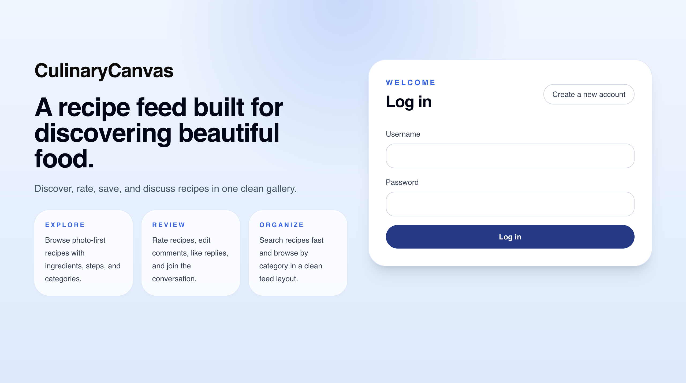
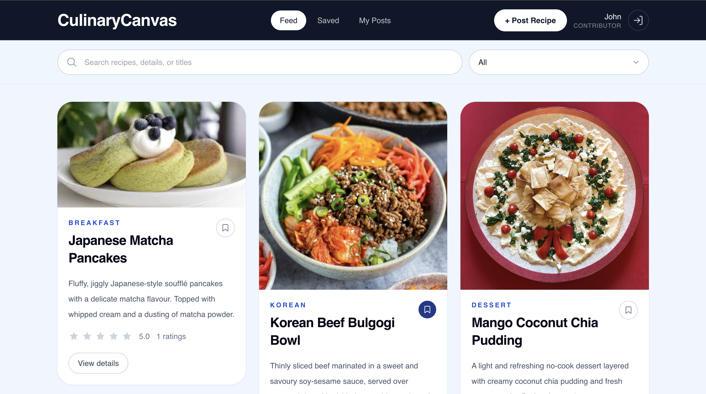
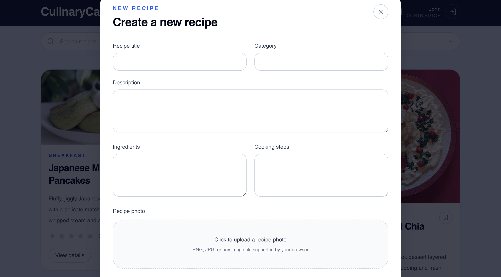
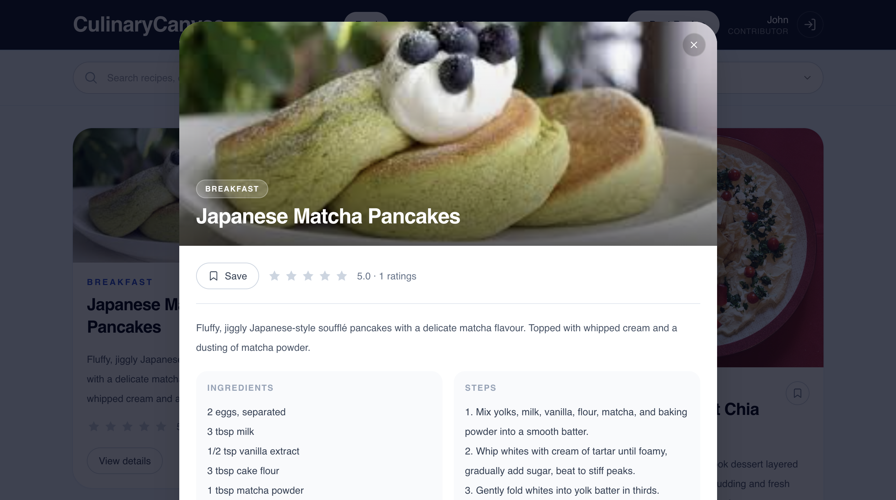
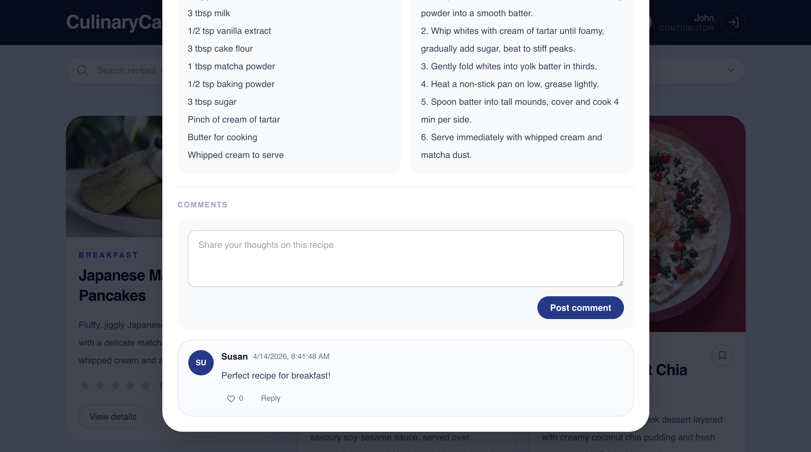

# CulinaryCanvas

## Project Description
CulinaryCanvas is a recipe sharing and rating web application where users can discover recipes, contributors can publish recipe posts, and admins can moderate content.

The system focuses on a photo-first experience and combines discovery, publishing, ratings, favorites, and threaded comments in one workflow.

### Problem It Solves
- Recipe sharing and feedback are often fragmented across multiple tools.
- CulinaryCanvas provides one place for posting, browsing, saving, rating, and discussing recipes.

### Target Users
- `user`: browse, rate, favorite, and comment on recipes.
- `contributor`: all user features + create/update/delete own recipes.
- `admin`: full moderation and management capabilities.

## System Architecture Overview
The backend is implemented as a layered monolith:

`Presentation -> Application -> Domain/Data -> Database`

- Presentation layer: HTTP routes and API contracts.
- Application layer: use-case orchestration.
- Domain layer: business rules and permission/validation logic.
- Data layer: persistence and repository access.

### Backend Layer Paths
- `backend/app/presentation/api/routes/`
- `backend/app/application/services/`
- `backend/app/domain/modules/`
- `backend/app/data/repositories/`

Main backend entrypoint: `backend/main.py`.

More details: `backend/ARCHITECTURE.md`.

## User Roles & Permissions
- `user`
- Can register/login, browse recipes, search/filter recipes, rate, favorite, comment/reply, and like comments.

- `contributor`
- All `user` permissions.
- Can create new recipes and edit/delete their own recipes.

- `admin`
- All `contributor` permissions.
- Can manage/moderate content across users.

## Technology Stack
### Frontend
- React
- Tailwind CSS
- Axios

### Backend
- FastAPI
- SQLAlchemy
- Pydantic

### Database
- SQLite

### Authentication & Security
- JWT authentication
- Password hashing with Passlib (`pbkdf2_sha256`)
- Role-based access checks in dependency guards/domain rules

## Installation & Setup Instructions
### Prerequisites
- Python 3.10+ (recommended)
- Node.js 18+ and npm

### 1. Clone Repository
```bash
git clone <your-repo-url>
cd CulinaryCanvas
```

### 2. Backend Setup
```bash
python3 -m venv venv
source venv/bin/activate
pip install -r backend/requirements.txt
```

### 3. Frontend Setup
```bash
cd frontend
npm install
cd ..
```

## How To Run The System
### Run Backend
```bash
source venv/bin/activate
cd backend
uvicorn main:app --reload
```

Backend URL: `http://127.0.0.1:8000`

### Run Frontend
```bash
cd frontend
npm start
```

Frontend URL: `http://localhost:3000`

## Core Features
- Login and registration
- JWT-based authentication
- Role-based access control (`user`, `contributor`, `admin`)
- Photo-first recipe posting
- Recipe create/edit/delete
- Search and category filtering
- Favorites and personal views (`Saved`, `My Posts`)
- Recipe rating (1-5 stars)
- Nested comments and replies
- Edit/delete/like for comments
- Toast notifications for user feedback

## API Overview
### User
- `POST /users/register`
- `POST /users/login`
- `GET /users/me`

### Recipes
- `GET /recipes/`
- `POST /recipes/`
- `PUT /recipes/{recipe_id}`
- `DELETE /recipes/{recipe_id}`

### Comments
- `GET /comments/recipe/{recipe_id}`
- `POST /comments/recipe/{recipe_id}`
- `PUT /comments/{comment_id}`
- `DELETE /comments/{comment_id}`
- `POST /comments/{comment_id}/like`
- `DELETE /comments/{comment_id}/like`

### Ratings
- `POST /ratings/recipe/{recipe_id}`

### Favorites
- `GET /favorites/`
- `POST /favorites/recipe/{recipe_id}`
- `DELETE /favorites/recipe/{recipe_id}`

## Screenshots Of Your System
### Login


### Feed


### Post Recipe


### Recipe Detail



## Project Structure
```text
CulinaryCanvas/
├── backend/
│   ├── app/
│   │   ├── application/
│   │   ├── config/
│   │   ├── core/
│   │   ├── data/
│   │   ├── domain/
│   │   ├── models/
│   │   ├── presentation/
│   │   └── schemas/
│   ├── main.py
│   ├── requirements.txt
│   └── ARCHITECTURE.md
├── frontend/
│   ├── public/
│   ├── src/
│   ├── package.json
│   ├── postcss.config.js
│   └── tailwind.config.js
└── docs/
    └── screenshots/
```
